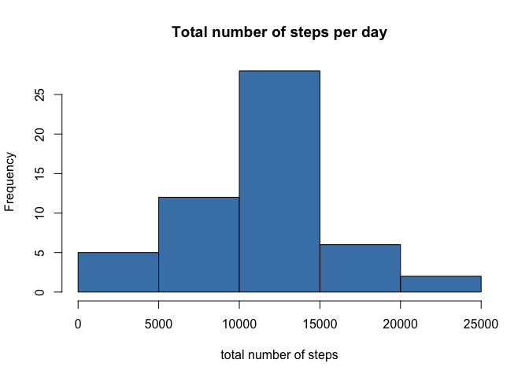
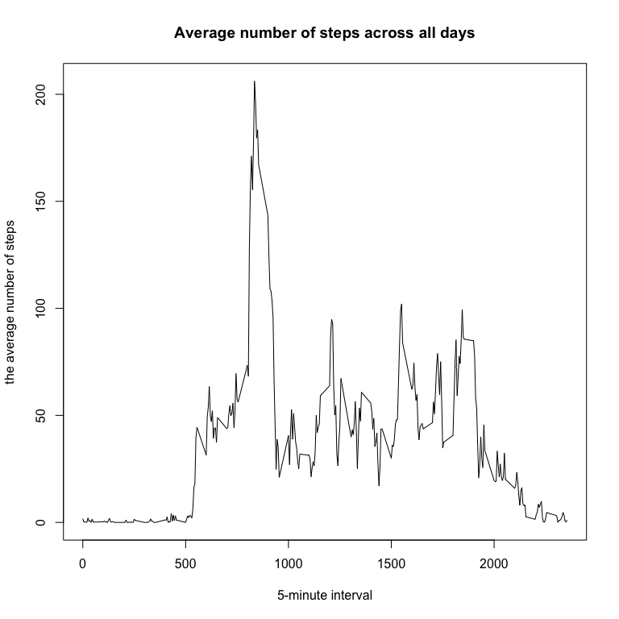
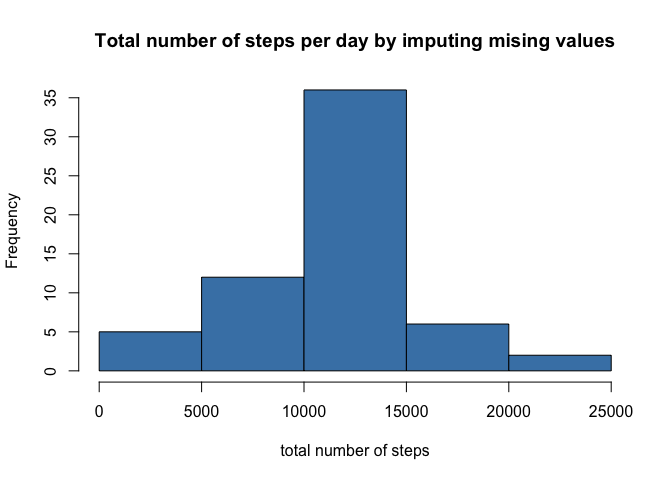
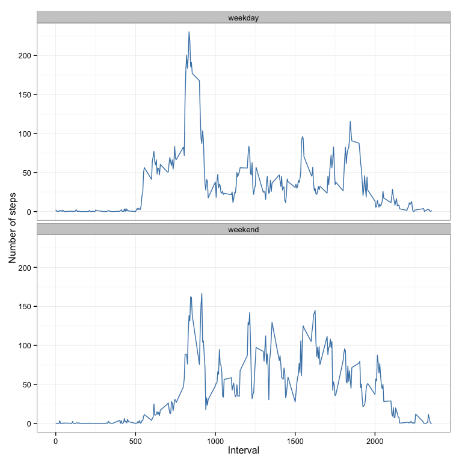

# Reproducible Research: Peer Assessment 1

This is an R Markdown document for processing data from a personal activity monitoring device.

## Loading and preprocessing the data
* Unzip activity.zip to get data file named activity.csv  
* And then load data from activity.csv   
* After that, preprocess the data for analysis

```r
unzip('activity.zip')
data <-read.csv('activity.csv')
data$date <- as.Date(data$date)
```


## What is mean total number of steps taken per day?
1. Calculate the total number of steps taken per day
Using tapply to caculate the sum of steps, while ignoring the NAs

```r
nona_data <- na.omit(data)
total_steps_per_day <- tapply(nona_data$steps, nona_data$date, sum)
```
2. Make a histogram of the total number of steps taken each day

```r
hist(total_steps_per_day, xlab= 'total number of steps', main='Total number of steps per day', col = 'steelblue')
```

 
3.Calculate and report the mean and median of the total number of steps taken per day  


```r
mean_total_steps_per_day <- mean(total_steps_per_day)
mean_total_steps_per_day
```

```
## [1] 10766.19
```
**Mean of the total number of steps taken per day: 10766.19 **


```r
median_total_steps_per_day <- median(total_steps_per_day)
median_total_steps_per_day
```

```
## [1] 10765
```
**Median of the total number of steps taken per day: 10765 **


## What is the average daily activity pattern?
1. Make a time series plot (i.e. type = "l") of the 5-minute interval (x-axis) and the average number of steps taken, averaged across all days (y-axis)


```r
ave_steps_by_interval <- aggregate(steps ~ interval, data = nona_data, mean)
plot(ave_steps_by_interval$interval, ave_steps_by_interval$steps, 
     main='Average number of steps across all days',
     xlab='5-minute interval', 
     ylab='the average number of steps',
     type='l')
```

 

2. Find the 5-minute interval, on average across all the days in the dataset, which contains the maximum number of steps  


```r
max_inter <- ave_steps_by_interval[which.max(ave_steps_by_interval$steps), ]
max_inter
```

```
##     interval    steps
## 104      835 206.1698
```

**On average across all the days, maximum number of steps is 206.1698, and the 5-minute interval is 835 **

## Imputing missing values
1. Calculate and report the total number of missing values in the dataset (i.e. the total number of rows with NAs)


```r
total_nas <- sum(!complete.cases(data))
total_nas
```

```
## [1] 2304
```

**The total number of rows with NAs is: 2304**

2. Use a strategy for filling in all of the missing values in the dataset, by mean number of steps for that 5-minute interval
3. Create a new dataset that is equal to the original dataset but with the missing data filled in

```r
imputed_data <- data
na_row <- which(!complete.cases(imputed_data))
for (i in na_row){
    interval_row <- which(imputed_data[i, "interval"] == ave_steps_by_interval$interval)
    imputed_data[i, "steps"] <- ave_steps_by_interval[interval_row, "steps"]
}
```

4. Make a histogram of the total number of steps taken each day and Calculate and report the mean and median total number of steps taken per day.

```r
imputed_total_steps_per_day <- tapply(imputed_data$steps, imputed_data$date, sum)
hist(imputed_total_steps_per_day, xlab= 'total number of steps', main='Total number of steps per day by imputing mising values', col = 'steelblue')
```

 

```r
# calculate mean
mean_imputed_total_steps_per_day <- mean(imputed_total_steps_per_day)
mean_imputed_total_steps_per_day
```

```
## [1] 10766.19
```

```r
# calculate median
median_imputed_total_steps_per_day <- median(imputed_total_steps_per_day)
median_imputed_total_steps_per_day
```

```
## [1] 10766.19
```

**After imputing missing values, the mean is 10766.19, the median is 10766.19**

**The mean is the same, the median has changed slightly.**  
The impact of imputing the missing values is adding a sample of data in the same distribution. the mean will not change, but the median may change because the sample number has changed.

## Are there differences in activity patterns between weekdays and weekends?
1. Create a new factor variable in the dataset with two levels ??? ???weekday??? and ???weekend??? indicating whether a given date is a weekday or weekend day.


```r
imputed_data$dayofweek <- weekdays(imputed_data$date) %in% c('Saturday', 'Sunday')
imputed_data$dayofweek <- factor(imputed_data$dayofweek, labels = c('weekday', 'weekend') )
```

2. Make a panel plot containing a time series plot (i.e. type = "l") of the 5-minute interval (x-axis) and the average number of steps taken, averaged across all weekday days or weekend days (y-axis).


```r
library(ggplot2)
imputed_ave_steps_by_interval <- aggregate(steps ~ interval + dayofweek, data = imputed_data, mean)
ggplot(imputed_ave_steps_by_interval, aes(x=interval, y=steps)) + 
        geom_line(color='steelblue') + 
        facet_wrap(~ dayofweek, nrow = 2, ncol = 1) +
        labs( x="Interval", y="Number of steps") +
        theme_bw()
```

 

